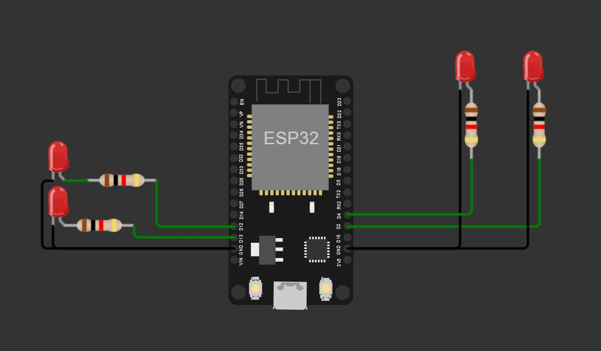
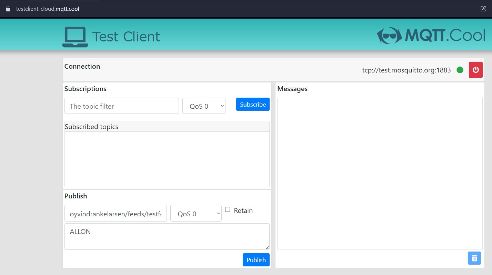

| Supported Targets | ESP32 | ESP32-C2 | ESP32-C3 | ESP32-C6 | ESP32-H2 | ESP32-S2 | ESP32-S3 |
| ----------------- | ----- | -------- | -------- | -------- | -------- | -------- | -------- |

# ESP32 MQTT + OTA

This project uses the MQTT-protocol to control 4 LEDs connected to an ESP32 board.
[wokwi project](https://wokwi.com/projects/379464083899436033)

It also checks for a new firmware version and, if found, installs it OTA (over the air). 

## How to use example

I use the ESP-IDF Visual Studio Code Extension by Espressif Systems.

[ESP32 Getting Started Guide](https://docs.espressif.com/projects/esp-idf/en/stable/get-started/index.html)

First you have to open a ESP-IDF terminal and run `idf.py uf2` to get the two partitions needed for OTA.

Then when you have a new version you update the version number in `main.c` and in `firmware.json`. After you build the project you move the `esp32ota.bin` to the bin folder and when you are ready to update you commit `firmware.json` to github.

To control the LEDs through the MQTT-protocol I use https://testclient-cloud.mqtt.cool. Select `tcp://test.mosquitto.org:1883` as broker. Then under Publish select the destination of the message to `oyvindrankelarsen/feeds/testfeed`.

Then you can publish 1,2,3 and 4 respectively to flip one of the leds on and off.
You can also publish ALLON to turn on all LEDs and ALLOFF to turn off all the LEDs.

Download a video showing the wokwi installation, running and OTA updating of the software here: [video.mp4](https://github.com/oyvindrankelarsen/esp32ota/raw/main/bin/video.mp4)

## ESP-IDF project

ESP-IDF projects are built using CMake. The project build configuration is contained in `CMakeLists.txt` files that provide set of directives and instructions describing the project's source files and targets (executable, library, or both).

For more information on structure and contents of ESP-IDF projects, please refer to Section [Build System](https://docs.espressif.com/projects/esp-idf/en/latest/esp32/api-guides/build-system.html) of the ESP-IDF Programming Guide.

## Warning

OTA updates are allowed over HTTP, this should only be used for testing purposes.